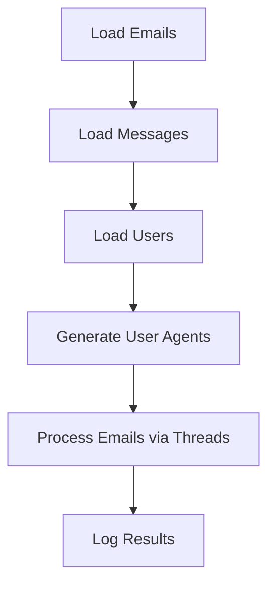

# 🌐  MASSACRE TG WEB

Automated script to process email addresses, send messages via HTTP requests, and manage users with multi-threading. Perfect for handling bulk actions efficiently! ⚡

## 📂 Features
- **Dynamic User Agents** 🤖
- **Multi-threading** 🧵
- **Real-time Logging** 📝
- **Email and User Processing** 📧
- **JSON Configuration** 📄

🎫 Coding Services SEND DM 🎫

🌐 MASSACRE TG WEB v3

Advanced email processing and messaging tool with improved efficiency, scalability, and security. Designed to handle large-scale operations seamlessly! 🚀
🚀 What's New in Version 3?
🌐 Automatic Proxy Validation

    Real-time scraping and validation of proxies.
    Configurable limits for valid proxies.
    Support for multiple proxy types (HTTP, HTTPS).

🌀 Asynchronous Processing

    Implemented asyncio and aiohttp for enhanced performance.
    Concurrent handling of GET and POST requests.

🤖 Advanced User-Agent Generation

    Wide variety of browser and operating system configurations.
    Enhanced realism and adaptability for each request.

🔄 Intelligent Proxy Distribution

    Balanced distribution of email processing across valid proxies.

📱 Multi-Country Phone Number Support

    Automatic generation of phone numbers for 20+ countries.

📝 Optimized Logging

    Detailed logs for auditing with enriched formatting and configurable levels.

📂 Key Features

    Complete Automation: Perfect for managing high volumes of data and requests.
    Enhanced Security: Proxy validation ensures anonymity and reliability.
    Adaptability: Compatible with diverse data configurations and inputs.
    JSON Flexibility: Configure messages, users, and emails using JSON files.

## 🛠️ Setup

### Requirements
- Python 3.8+
- Dependencies in `requirements.txt`

. Ensure your data files are ready:
   - `emails.txt` for email addresses.
   - `report.json` for message data.
   - `main.json` for user details.

## 🏃‍♂️ Usage
Run the script:
```bash
python script.py
```

## 📦 File Structure
| File/Folder    | Description                              |
|----------------|------------------------------------------|
| `emails.txt`   | List of email addresses to process.      |
| `report.json`  | JSON containing messages (`SPAM` key).   |
| `main.json`    | User details (`id`, `username`, etc.).   |
| `results.log`  | Log file for process results.            |

## ⚙️ Workflow


## 📧 Example Data

### `emails.txt`
```
email1@example.com
email2@example.com
```

### `report.json`
```json
{
  "SPAM": ["Message 1", "Message 2"]
}
```

### `main.json`
```json
[
  {"info": {"id": 1, "username": "user1"}, "status": "success"}
]
```
 


## ⚠️ Disclaimer
This tool is for educational purposes only. Use responsibly and ensure compliance with Telegram's terms of service.

## 🤝 Contributing
Feel free to submit issues or pull requests to improve the project!
