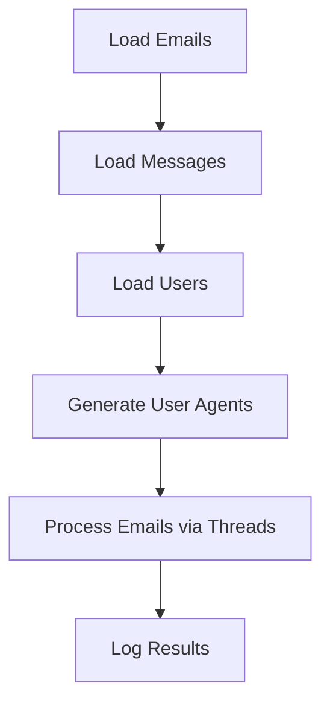

# 🌐  MASSACRE TG WEB

Automated script to process email addresses, send messages via HTTP requests, and manage users with multi-threading. Perfect for handling bulk actions efficiently! ⚡

## 📂 Features
- **Dynamic User Agents** 🤖
- **Multi-threading** 🧵
- **Real-time Logging** 📝
- **Email and User Processing** 📧
- **JSON Configuration** 📄

## 🛠️ Setup

### Requirements
- Python 3.8+
- Dependencies in `requirements.txt`

### Installation
1. Clone this repository:
   ```bash
   git clone https://github.com/yourusername/telegram-email-processor.git
   cd telegram-email-processor
   ```
2. Install dependencies:
   ```bash
   pip install -r requirements.txt
   ```

3. Ensure your data files are ready:
   - `emails.txt` for email addresses.
   - `report.json` for message data.
   - `main.json` for user details.

## 🏃‍♂️ Usage
Run the script:
```bash
python script.py
```

## 📦 File Structure
| File/Folder    | Description                              |
|----------------|------------------------------------------|
| `emails.txt`   | List of email addresses to process.      |
| `report.json`  | JSON containing messages (`SPAM` key).   |
| `main.json`    | User details (`id`, `username`, etc.).   |
| `results.log`  | Log file for process results.            |

## ⚙️ Workflow


## 📧 Example Data

### `emails.txt`
```
email1@example.com
email2@example.com
```

### `report.json`
```json
{
  "SPAM": ["Message 1", "Message 2"]
}
```

### `main.json`
```json
[
  {"info": {"id": 1, "username": "user1"}, "status": "success"}
]
```

## 🤝 Contributing
Pull requests are welcome! For major changes, please open an issue first.

 
