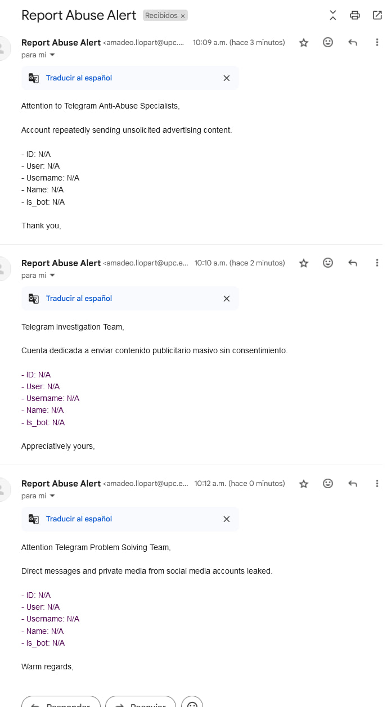
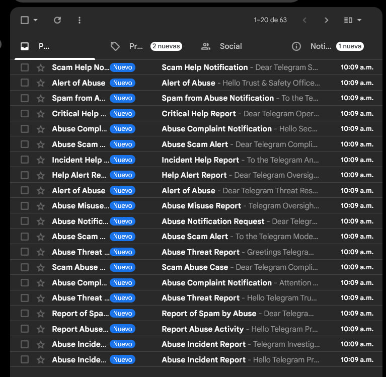
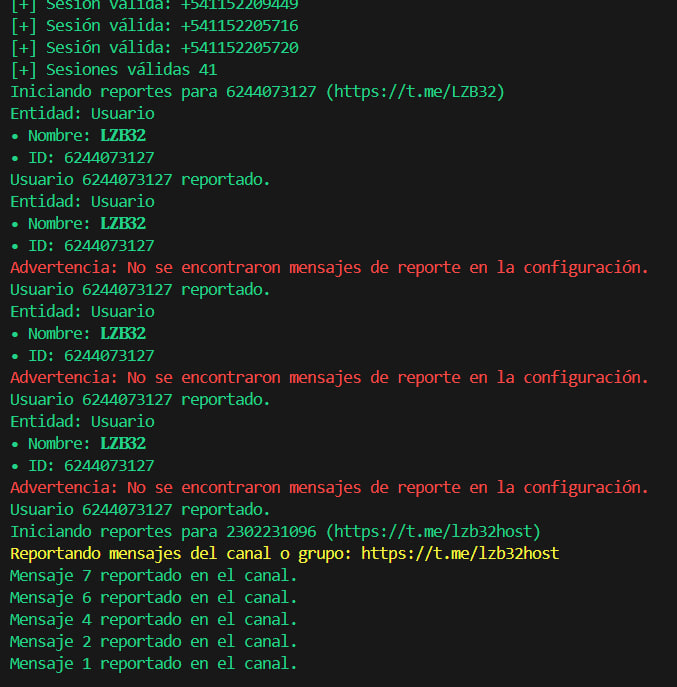
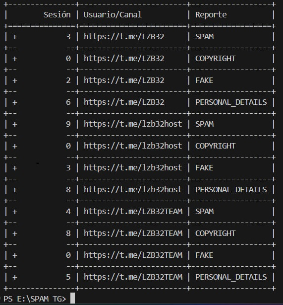
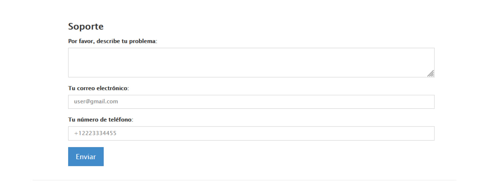

# 🎫 Coding Services SEND DM 🎫

## 📝 Requirements

- Python 3.8+
- Telethon Library (`pip install telethon`)

# 📡 Entity Processor

Processes Telegram entities (users, channels, and groups) and saves detailed information in a JSON file.

- 🛠️ Automatically loads or creates Telegram sessions.
- 📂 Processes users, groups, and channels (public or private).
- 📊 Retrieves member, admin, and statistical information.
- 💾 Saves processed data to `valid_data.json`.

```python
async def process_entity(client, entity_input, admin_limit=100):
    if not entity_input:
        return {"status": "invalid_input", "details": "Empty or None input", "link": "N/A", "input": entity_input}

    try:
        entity = await client.get_entity(entity_input)
        link = f"https://t.me/{entity.username}" if hasattr(entity, 'username') and entity.username else "N/A"

        if isinstance(entity, types.User):
            return {
                "status": "success",
                "input": entity_input,
                "type": "user",
                "link": link,
                "info": {
                    "id": entity.id,
                    "user": entity_input,  
                    "username": entity.first_name or "N/A",
                    "name": f"{entity.first_name or ''} {entity.last_name or ''}".strip(),
                    "is_bot": "Yes" if entity.bot else "No",
                },
            }

        # Procesar canales o grupos
        elif isinstance(entity, types.Channel):
            full_chat = await client(functions.channels.GetFullChannelRequest(entity))
            chat_type = "public" if entity.username else "private"
            metadata = {
                "id": entity.id,
                "title": entity.title,
                "username": f"@{entity.username or 'N/A'}",
                "members": full_chat.full_chat.participants_count,
                "description": full_chat.full_chat.about or "N/A",
                "admins": [],
            }

            try:
                offset, total_admins = 0, []
                while True:
                    admins_data = await client(functions.channels.GetParticipantsRequest(
                        channel=entity,
                        filter=types.ChannelParticipantsAdmins(),
                        offset=offset,
                        limit=admin_limit,
                        hash=0,
                    ))
                    total_admins.extend([
                        {
                            "id": admin.user_id,
                            "username": admin.user.first_name or "N/A",  # Nombre real del admin
                            "user": f"@{admin.user.username or 'N/A'}",  # Identificador como @username
                            "arorab": admin.rank if hasattr(admin, 'rank') else "N/A",
                            "link": f"https://t.me/{admin.user.username}" if admin.user.username else "N/A",
                        }
                        for admin in admins_data.participants if isinstance(admin, types.ChannelParticipantAdmin)
                    ])
                    if len(admins_data.participants) < admin_limit:
                        break
                    offset += admin_limit

                metadata["admins"] = total_admins
            except errors.ChatAdminRequiredError:
                metadata["admins"] = "Restricted (Admin privileges required)"
            except Exception as e:
                metadata["admins"] = f"Error retrieving admins: {str(e)}"

            return {
                "status": "success",
                "input": entity_input,
                "type": "channel" if not entity.megagroup else "group",
                "privacy": chat_type,
                "link": link,
                "info": metadata,
            }

        # Entidad desconocida
        else:
            return {"status": "unknown_entity", "input": entity_input, "link": link, "details": "Entity type not recognized"}

    except (errors.UserDeactivatedError, errors.AuthKeyInvalidError) as e:
        return {"status": "account_issue", "details": str(e), "link": "N/A", "input": entity_input}
    except errors.ChannelPrivateError:
        return {"status": "private_channel", "link": "N/A", "details": "Channel is private or access is denied", "input": entity_input}
    except errors.FloodWaitError as e:
        print(f"FloodWaitError: Esperando {e.seconds} segundos...")
        await asyncio.sleep(e.seconds)
        return {"status": "flood_wait", "link": "N/A", "details": f"Flood wait for {e.seconds} seconds", "input": entity_input}
    except errors.RPCError as e:
        return {"status": "rpc_error", "link": "N/A", "details": str(e), "input": entity_input}
    except Exception as e:
        return {"status": "error", "link": "N/A", "details": str(e), "input": entity_input}

```

---

# REPORT CONTENT

```python
import random

headers = [
    "Dear Telegram Compliance Monitoring Team,",
    "Hello Telegram Policy Team,",
    "To the Telegram Trust Enforcement Team,",
]

footers = [
    "Warmly,",
    "With heartfelt thanks,",
    "Ever grateful,",
]

static_message = "We have detected irregular activity in the following account."
details = "Account ID: 123456"

header = random.choice(headers)
footer = random.choice(footers)
message = f"""{header}\n\n{static_message}\n\n{details}\n\n{footer}\nBye"""

```

---

# 📧 MASSACRE TG SMTP 

<div style="display: flex; justify-content: space-between; align-items: center;">
    
    
</div> 

---

# 📊 MASSACRE TG SESSIONS

<div style="display: flex; justify-content: space-between; align-items: center;">
    
    
</div>

---

# 🌐  MASSACRE TG WEB

 
